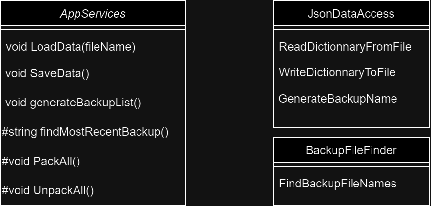
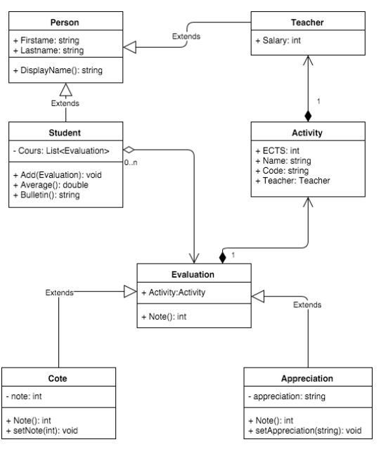

# Readme - Projet .NET MAUI "School Manager"

## Description du Projet

Bienvenue dans le projet "School Manager" ! Ce projet s'inspire de l'exercice du laboratoire 2 et vise à créer une interface MAUI pour gérer divers aspects liés à la gestion scolaire. Les fonctionnalités principales du projet sont les suivantes :

1. **Création d'Étudiants:** Permet de créer de nouveaux étudiants.
2. **Création d'Enseignants:** Permet de créer de nouveaux enseignants.
3. **Création d'Activités:** Permet de créer de nouvelles activités.
4. **Création d'Évaluations:** Permet d'ajouter des évaluations pour un cours spécifique attribué à un étudiant, incluant une cote ou une appréciation.
5. **Bulletin:** Permet d'afficher le bulletin des étudiants.

## Fonctionnalité Additionnelle

En plus des fonctionnalités de base, une fonctionnalité supplémentaire a été ajoutée :

- **Rollback des Backups:** La possibilité de faire un rollback des sauvegardes précédentes pour restaurer les données à un état antérieur.

## Sauvegarde des Données

Les données du projet "School Manager" sont sauvegardées sous forme d'un fichier JSON au moment de l'arrêt du programme et sont chargées à l'exécution du programme suivant. Cette approche garantit la persistance des données entre les sessions d'utilisation.

## Comment ça Fonctionne

Lorsque vous fermez l'application, un processus de sauvegarde est déclenché pour enregistrer l'état actuel des données dans un fichier JSON. Ce fichier contiendra toutes les informations nécessaires sur les étudiants, enseignants, activités, évaluations, et autres données pertinentes.

Lorsque vous démarrez à nouveau l'application, le programme vérifie la présence du fichier JSON de sauvegarde. Si le fichier est trouvé, les données sont chargées à partir de ce fichier, restaurant ainsi l'état précédent de l'application.
Si vous souhaitez revenir en arriere vous en avez la possibilité
Enfin, il est possible de sauvegarder manuellement a tout moment.

Pour utiliser l'application il est possible que le programme ne trouve pas le dossier backup. Pour regleer le probleme il faut aller dans le fichier appServices et corriger le directory path ou dans certains cas creer un dossier backup si il ne s'est pas créé tout seul.

## Manipulation des Fichiers JSON

La manipulation des fichiers JSON est réalisée de manière sécurisée, en utilisant les fonctionnalités fournies par les bibliothèques NewtonSoft.Json. 

## Diagrammes UML

NBP: toutes les classes des modeles sont des classes dynamiques et possèdent toutes des propriétés pour chaque attribut et un UID. Les attributs étants des objets sont en fait les UIDs des objets correscpondants

